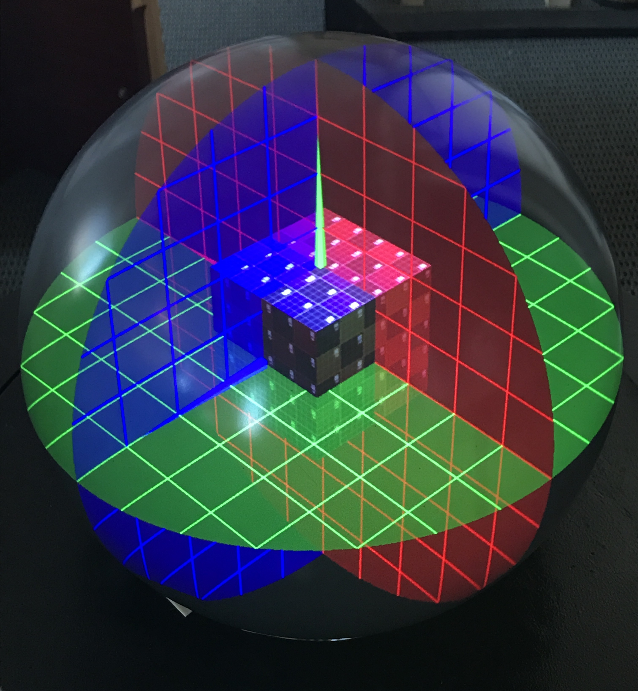
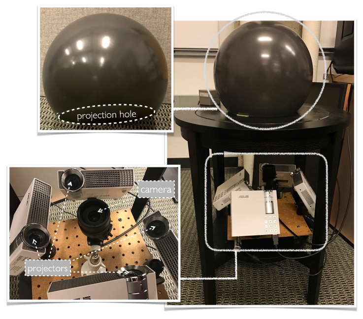
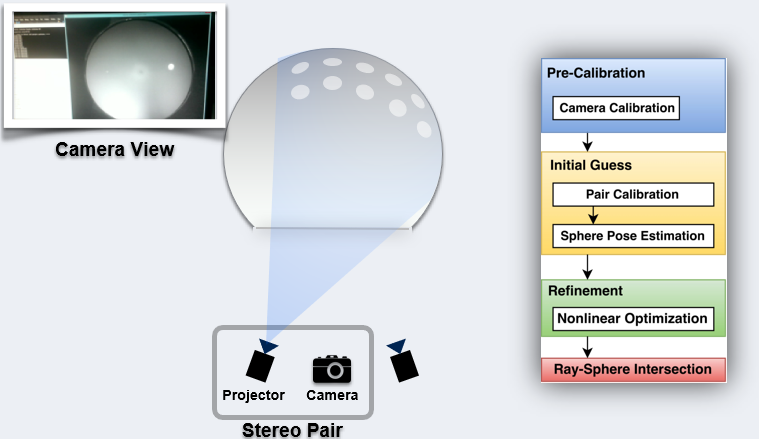
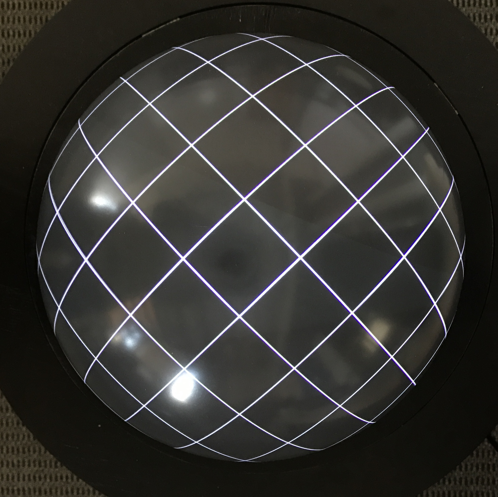
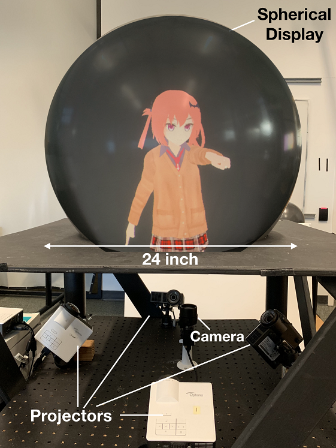
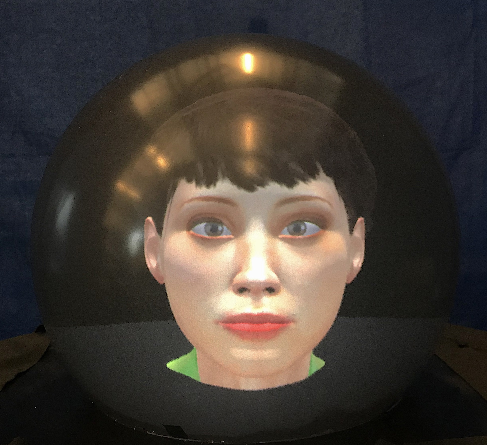
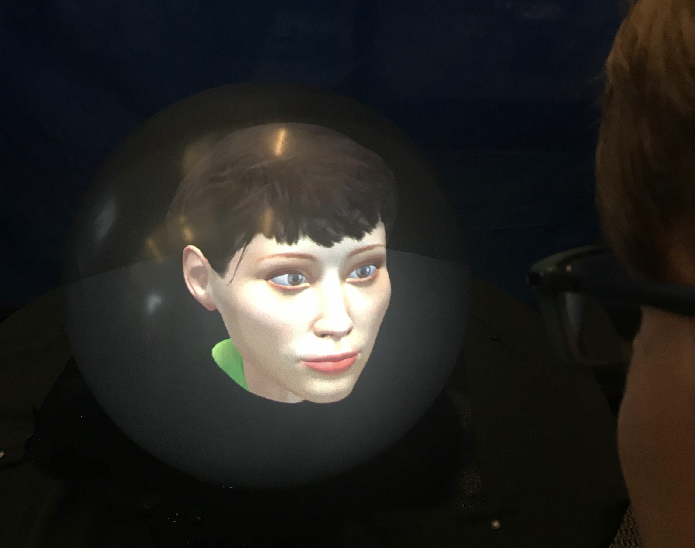

Crystal: a spherical Fish Tank VR display {#crystal}
========

     
Crystal is an interactive spherical 3D display based on fish tank VR that uses stereo and head-coupled virtual reality on high-resolution desktop displays. Our new class of fish tank VR display technology uses the spherical shape to create a contained virtual reality volume. It allows visualization and interaction with 360 degrees of visibility.  We investigated the perceptual factors focusing on depth perception in the virtual environment. Prototypes of Crystal have been demonstrated in several conferences such as SIGCHI and IEEE VR.

## Publication
__Qian Zhou__, Fan Wu, Ian Stavness, and Sidney Fels.  Closer object looks smaller: Investigating the duality of size perception in a spherical fish tank VR display. In *Proceedings of the  2020  CHI  Conference  on  Human  Factors  in  Computing  Systems*, ACM, 2020, to appear.

__Qian Zhou__, Georg Hagemann, Dylan Fafard, Ian Stavness, and Sidney Fels.  An evaluation of depth and size perception on a spherical fish tank virtual reality display.   *IEEE  Transactions  on  Visualization  and Computer Graphics (TVCG)*, 25(5): 2040–2049, 2019.

__Qian Zhou__, Fan Wu, Ian Stavness, and Sidney Fels.  Match the cube: Investigation of the head-coupled input with a spherical fish tank virtual reality display.  In *IEEE Conference on Virtual Reality and 3D User Interfaces (VR)*, pages 1281–1282. IEEE, 2019.

__Qian  Zhou__,  Gregor  Miller,  Kai  Wu,  Ian  Stavness,  and  Sidney  Fels. Analysis and practical minimization of registration error in a spherical fish  tank  virtual  reality  system. In *Asian  Conference  on  Computer Vision (ACCV)*, pages 519–534. Springer, 2016.
## Video

------
CoGlobe: a co-located multi-person Fish Tank VR experience
========

 

We expanded the design of [Crystal](#crystal) to supports multiple people co-located in a shared space working and playing together through two different multiplayer games and tasks. Additional viewers can also watch using a variation of mixed reality with a tracked mobile smartphone. Using a smartphone as a second screen registered to the same virtual world enables multiple people to interact together. Prototype of CoGlobe has been demonstrated during 2018 Siggraph Emerging Technologies

## Publication

__Qian  Zhou__  Georg  Hagemann,  Sidney  Fels,  Dylan  Fafard,  Andrew Wagemakers,  Chris  Chamberlain,  and  Ian  Stavness. Coglobe:   a co-located  multi-person  fish tank VR  experience.   In *ACM  SIGGRAPH  2018 Emerging Technologies*, page 5-6. ACM, 2018.

Dylan Fafard,  __Qian  Zhou__,  Chris  Chamberlain,  Georg  Hagemann, Sidney Fels, and Ian Stavness.  Design and implementation of a multi-person fish tank virtual reality display.  In *Proceedings  of  the 24th  ACM  Symposium  on  Virtual  Reality  Software  and  Technology (VRST)*, page 1-9. ACM, 2018.

## Video

## Media and Press 

------
# GripMark: Transform Hand Grips into Tangible Input in MR

description

## Publication

__Qian Zhou__, Sarah Sykes, Sidney Fels, and Kenrick Kin.  Gripmarks: Using hand grips to transform in-hand objects into Mixed Reality input. In *Proceedings of the  2020  CHI  Conference on Human Factors in Computing Systems*, ACM, 2020, to appear.

------
# Automatic Calibration of Multiple-projector Display Systems

  

description

## Publication

__Qian Zhou__, Gregor Miller, Kai Wu, Daniela Correa, and Sidney Fels. Automatic  calibration of a multiple-projector spherical fish tank VR display. In *IEEE Winter Conference on Applications of Computer Vision (WACV)*, pages 1072–1081. IEEE, 2017.

__Qian  Zhou__,  Kai  Wu,  Gregor  Miller,  Ian  Stavness,  and  Sidney  Fels. 3dps: An  auto-calibrated  three-dimensional perspective-corrected spherical display.  In *Virtual  Reality  (VR)*,  2017  IEEE,  pages  455–456. IEEE, 2017.

------
# I Got Your Point: Perceiving Pointing Gesture in the Virtual Environment 

  
description

## Publication

Fan Wu, __Qian Zhou__, Kyoungwon Seo, Toshiro Kashiwaqi, and Sidney Fels. I got your point:  An investigation of pointing cues in a spherical fish tank virtual reality display.  In *IEEE Conference on Virtual Reality and 3D User Interfaces (VR)*, pages 1237–1238. IEEE, 2019.

------
# Realistic Eye Contact in the Virtual Environment 

  
description

## Publication

Georg  Hagemann,  __Qian Zhou__,  Ian  Stavness,  and  Sidney  Fels. Investigating spherical fish tank virtual reality displays for establishing realistic eye-contact. In *IEEE Conference on Virtual Reality and3D User Interfaces (VR)*, pages 950–951. IEEE, 2019.

Georg  Hagemann,  __Qian  Zhou__,  Ian  Stavness,  Oky Dicky Ardiansyah Prima, and Sidney S Fels. Here’s looking at you:  A spherical ftvr display for realistic eye-contact. In *Proceedings of the 2018 ACM International Conference on Interactive Surfaces and Spaces (ISS)*, pages 357–362. ACM, 2018.